# Tutorial Penggunaan Akun Dosen

Panduan ini menjelaskan penggunaan portal dosen SIAKAD: masuk ke akun, membaca dashboard, memperbarui profil, melihat jadwal, mengisi presensi, meninjau evaluasi, mengelola nilai akhir dan tugas, serta memberikan keputusan KRS mahasiswa bimbingan.

> **Catatan gambar:** tangkapan layar menggunakan akun dosen demo NIDN **2102119602**. Nama, mata kuliah, mahasiswa, periode, dan nilai pada gambar merupakan data demonstrasi, bukan petunjuk data yang harus diisikan pada akun Anda.

## Daftar isi

1. [Masuk ke portal dosen](#1-masuk-ke-portal-dosen)
2. [Mengenal dashboard](#2-mengenal-dashboard)
3. [Memperbarui profil dan kata sandi](#3-memperbarui-profil-dan-kata-sandi)
4. [Melihat dan mengunduh jadwal mengajar](#4-melihat-dan-mengunduh-jadwal-mengajar)
5. [Mengisi presensi per pertemuan](#5-mengisi-presensi-per-pertemuan)
6. [Meninjau evaluasi perkuliahan](#6-meninjau-evaluasi-perkuliahan)
7. [Mengelola nilai akhir](#7-mengelola-nilai-akhir)
8. [Membuat dan menilai tugas](#8-membuat-dan-menilai-tugas)
9. [Menyetujui atau menolak KRS](#9-menyetujui-atau-menolak-krs)
10. [Keluar dari akun](#10-keluar-dari-akun)
11. [Kendala umum](#11-kendala-umum)

## 1. Masuk ke portal dosen

1. Buka `[alamat-aplikasi]/dosen/auth-signin`.
2. Pastikan tab **Dosen** di bagian atas sedang aktif.
3. Isi kolom identitas menggunakan salah satu data berikut:
   - NIDN;
   - nomor telepon; atau
   - alamat email yang terdaftar.
4. Isi **Kata sandi**.
5. Centang **Ingat saya di perangkat ini** hanya pada perangkat pribadi.
6. Selesaikan verifikasi keamanan jika ditampilkan.
7. Klik **Masuk ke portal**.

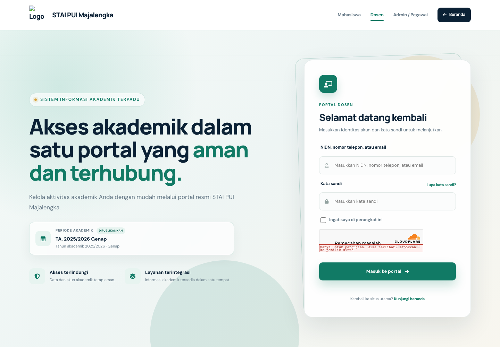

Jangan membagikan kata sandi atau menyimpan sesi login pada komputer umum. Jika akun belum aktif atau data login ditolak, hubungi pengelola SIAKAD.

## 2. Mengenal dashboard

Setelah login berhasil, dashboard menampilkan periode akademik yang sedang digunakan dan ringkasan pekerjaan dosen.

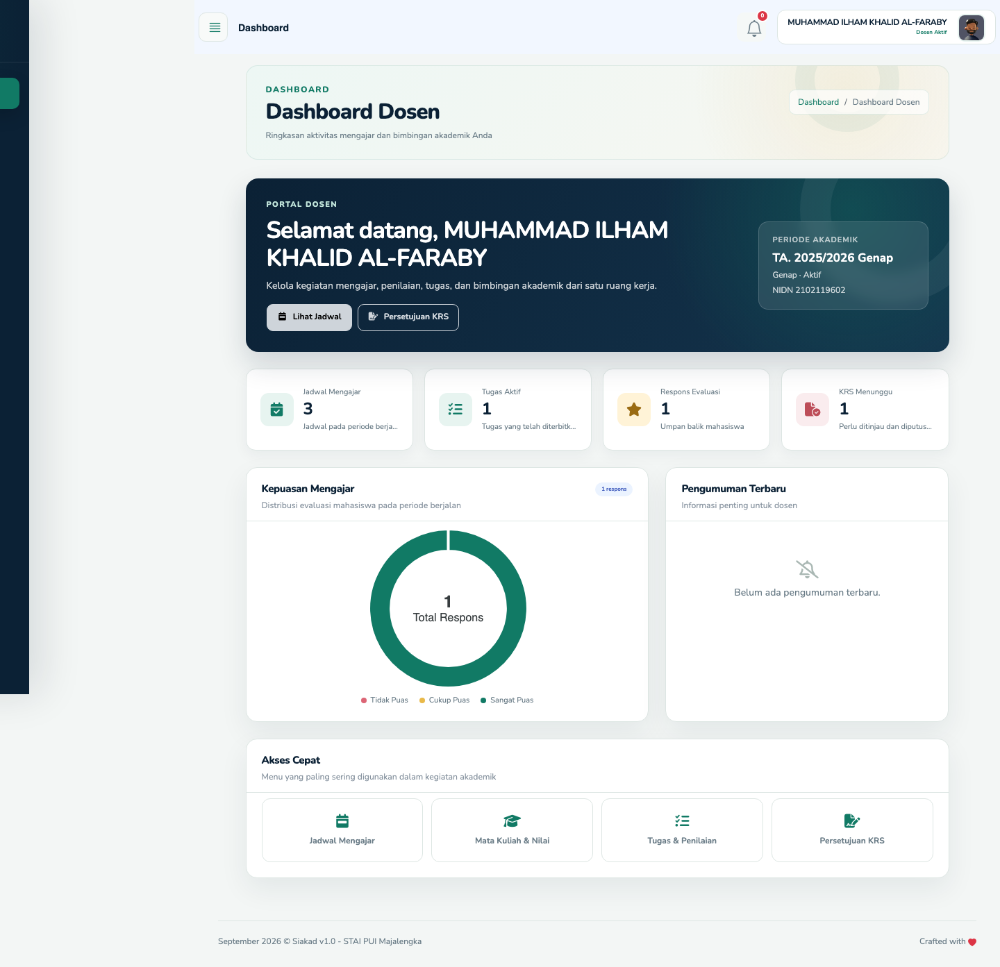

Bagian penting pada dashboard:

| Bagian | Kegunaan |
|---|---|
| Periode akademik | Memastikan kegiatan dilakukan pada semester/periode yang benar. |
| Jadwal Mengajar | Jumlah jadwal dosen pada periode berjalan. |
| Tugas Aktif | Jumlah tugas yang telah diterbitkan. |
| Respons Evaluasi | Jumlah umpan balik perkuliahan yang masuk. |
| KRS Menunggu | Pengajuan KRS mahasiswa bimbingan yang harus ditinjau. |
| Kepuasan Mengajar | Ringkasan hasil evaluasi mahasiswa. |
| Pengumuman Terbaru | Informasi yang ditujukan kepada dosen. |
| Akses Cepat | Pintasan ke jadwal, nilai, tugas, dan persetujuan KRS. |

Menu utama portal dosen terdiri dari **Beranda**, **Jadwal Mengajar**, **Mata Kuliah & Nilai**, **Tugas & Penilaian**, dan **Persetujuan KRS**. Pada layar kecil, klik ikon menu di kiri atas untuk membuka navigasi.

## 3. Memperbarui profil dan kata sandi

1. Klik nama atau foto akun di kanan atas.
2. Buka menu **My Profile/Profile**.
3. Gunakan bagian **Ubah Foto Profile** untuk memilih dan mengunggah foto.
4. Pada tab **Personal**, periksa nama, NIDN, jenis kelamin, tempat lahir, dan tanggal lahir, lalu klik **Save**.
5. Pada tab **Kontak**, perbarui data kontak yang diizinkan.
6. Pada tab **Security**, ubah kata sandi jika diperlukan.

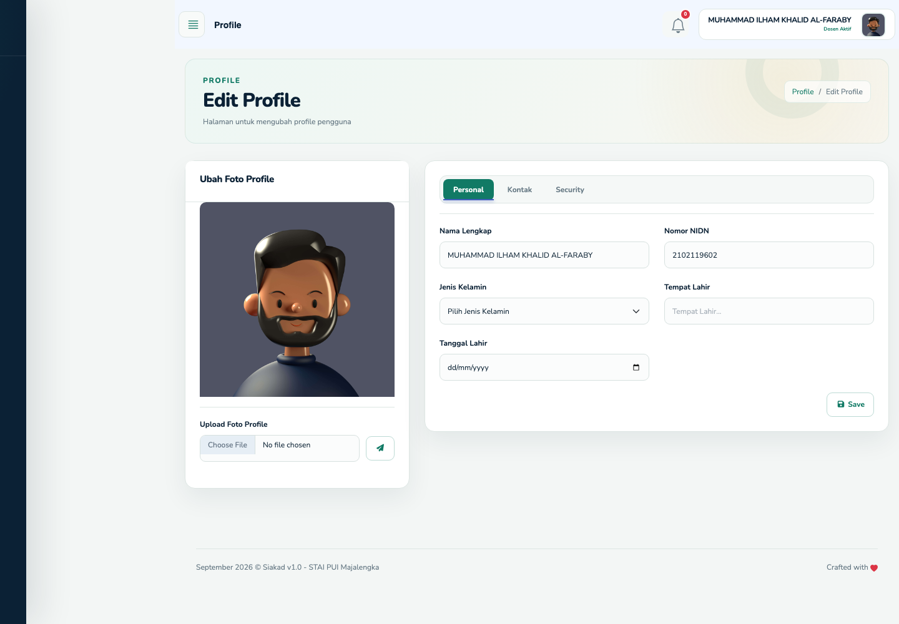

Gunakan kata sandi yang unik. Hubungi Academic atau Administrator apabila NIDN, status dosen, atau penugasan mengajar tidak sesuai karena data tersebut tidak diperbaiki melalui profil pribadi.

## 4. Melihat dan mengunduh jadwal mengajar

1. Buka **Jadwal Mengajar**.
2. Pastikan periode pada bagian **Agenda Mengajar** sudah benar.
3. Gunakan pencarian atau filter **Kelas**, **Hari**, dan **Ruangan** bila daftar jadwal cukup banyak.
4. Klik **Terapkan** untuk menjalankan filter.
5. Periksa mata kuliah, hari, jam, kelas, ruang/gedung, dan jumlah SKS.
6. Klik **Download Jadwal Mingguan** untuk menyimpan jadwal dalam format PDF.
7. Klik tombol jumlah pertemuan, misalnya **4 Pertemuan**, untuk membuka daftar pertemuan.

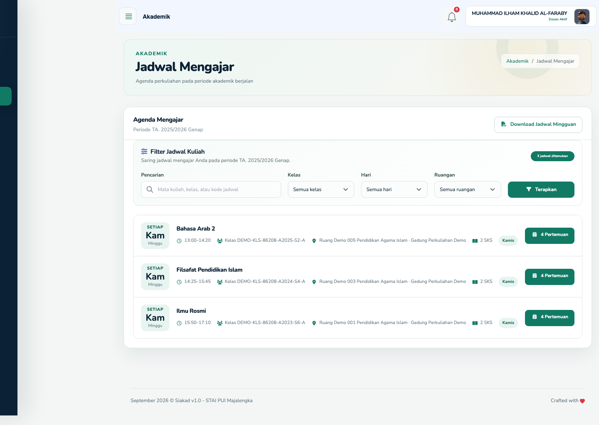

Jadwal hanya menampilkan kelas yang ditugaskan kepada akun dosen pada periode yang dipublikasikan. Laporkan bentrok atau ketidaksesuaian penugasan kepada Academic.

## 5. Mengisi presensi per pertemuan

Setelah membuka suatu jadwal, sistem menampilkan tanggal, waktu, status, jumlah presensi, dan aksi untuk setiap pertemuan.

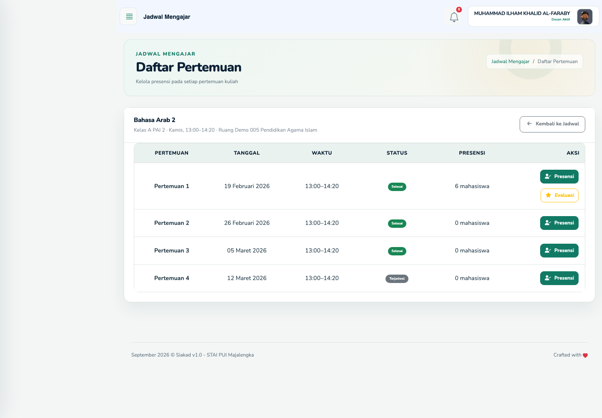

Langkah pengisian:

1. Pastikan mata kuliah, kelas, tanggal, dan nomor pertemuan sudah benar.
2. Klik **Presensi** pada pertemuan yang akan diisi.
3. Untuk setiap mahasiswa, pilih salah satu status:
   - **Hadir**;
   - **Izin**;
   - **Sakit**; atau
   - **Alpa**.
4. Isi **Keterangan** bila diperlukan.
5. Pastikan seluruh peserta sudah diberi status.
6. Klik **Simpan Presensi** dan periksa pesan berhasil.

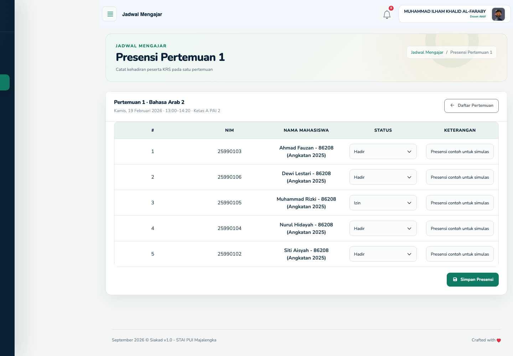

Presensi harus dicatat pada pertemuan yang benar. Jangan memindahkan data kehadiran dari pertemuan lain hanya karena daftar mahasiswanya sama.

## 6. Meninjau evaluasi perkuliahan

1. Buka **Jadwal Mengajar**, lalu masuk ke **Daftar Pertemuan**.
2. Klik **Evaluasi** pada pertemuan yang telah menerima evaluasi mahasiswa.
3. Tinjau jumlah respons, nilai rata-rata, distribusi kepuasan, hasil per bagian/pertanyaan, dan komentar yang tersedia.
4. Gunakan hasilnya sebagai bahan perbaikan pembelajaran.

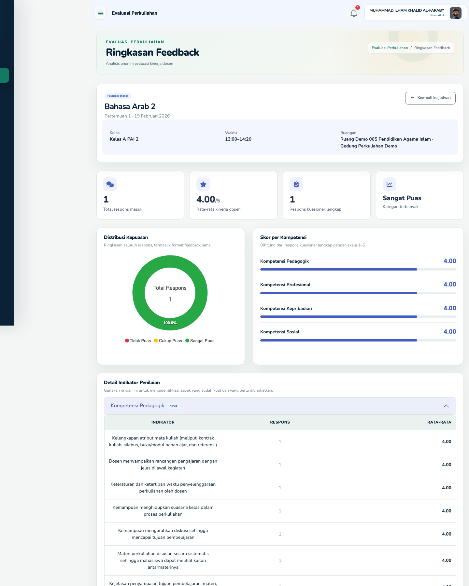

Tombol evaluasi hanya muncul ketika data evaluasi tersedia. Hormati anonimitas mahasiswa dan jangan mencoba mengidentifikasi pemberi respons.

## 7. Mengelola nilai akhir

1. Buka **Mata Kuliah & Nilai**.
2. Periksa mata kuliah, kelas, program studi, jumlah peserta, dan progres pengisian nilai.
3. Klik **Kelola Nilai** pada kelas yang akan dinilai.

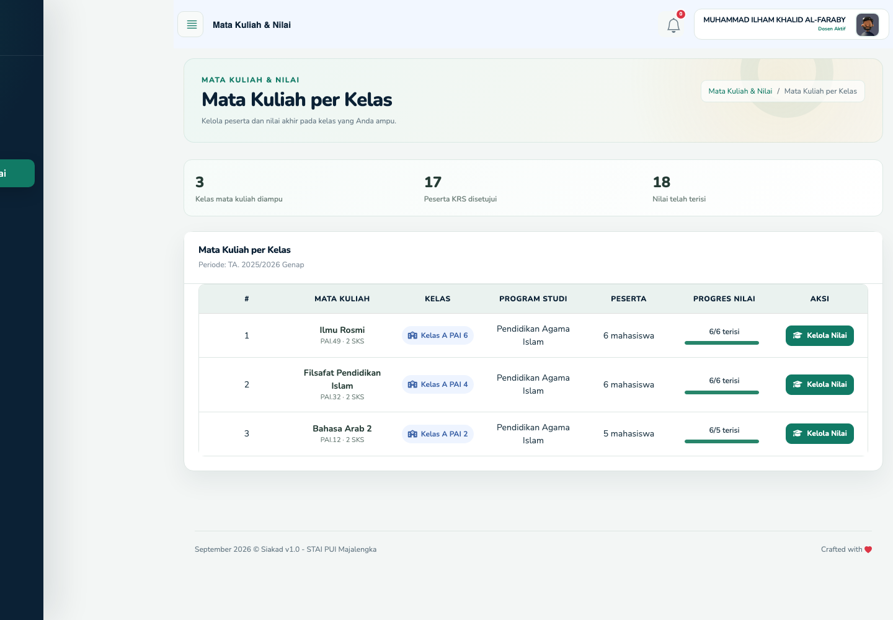

Pada halaman pengelolaan nilai:

1. Pastikan identitas mata kuliah, kelas, periode, dan jumlah peserta sudah benar.
2. Cari mahasiswa menggunakan NIM atau nama bila diperlukan.
3. Pilih nilai akhir **A**, **B**, **C**, **D**, atau **E**. Nilai yang dibiarkan kosong akan disimpan sebagai belum dinilai.
4. Klik **Simpan Nilai/Simpan Perubahan**.
5. Periksa kembali progres pengisian dan pesan berhasil.

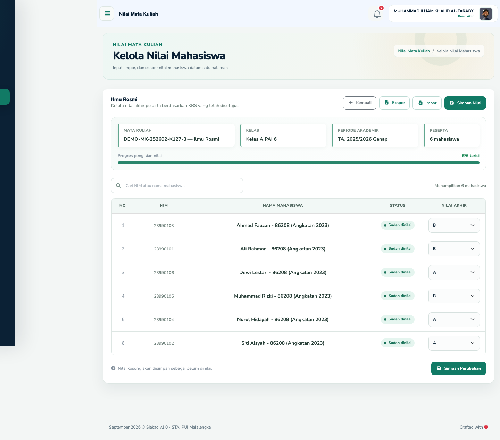

Untuk pengisian massal:

1. Klik **Ekspor** untuk mengunduh template berisi NIM, nama mahasiswa, dan nilai saat ini.
2. Isi kolom **Nilai** dengan A–E tanpa mengubah NIM peserta.
3. Klik **Impor**, pilih berkas XLSX atau CSV berukuran maksimal 5 MB, lalu jalankan impor.
4. Baca hasil validasi. Baris dengan NIM yang bukan peserta, NIM ganda, atau nilai di luar A–E akan ditolak.

Nilai hanya dapat diubah ketika periode akademik masih dapat ditulis. Periksa semua nilai sebelum periode ditutup atau diarsipkan.

## 8. Membuat dan menilai tugas

### Membuat tugas

1. Buka **Tugas & Penilaian**.
2. Klik tombol **+**.
3. Pilih jadwal kuliah yang diampu.
4. Isi tanggal dan waktu batas akhir.
5. Isi judul serta detail/instruksi tugas dengan jelas.
6. Klik tombol kirim/simpan.
7. Pastikan tugas muncul pada daftar.

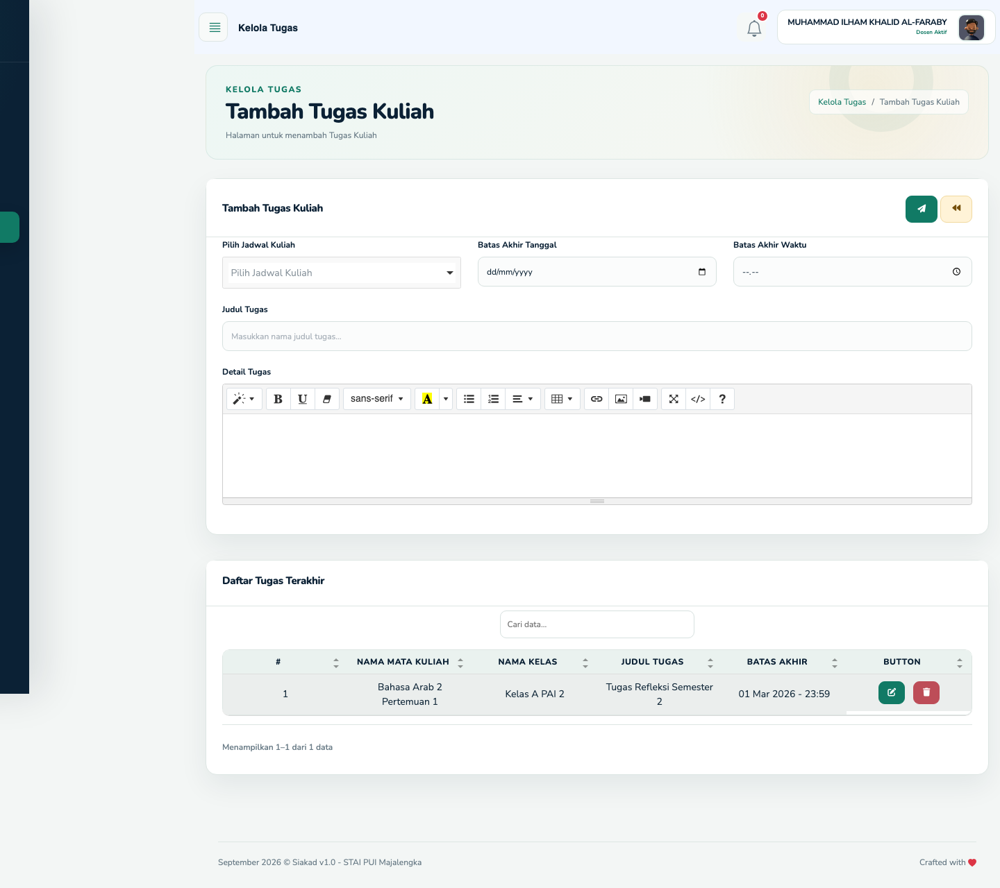

Kembali ke daftar untuk memastikan tugas tersimpan dan melihat tombol tindakannya.

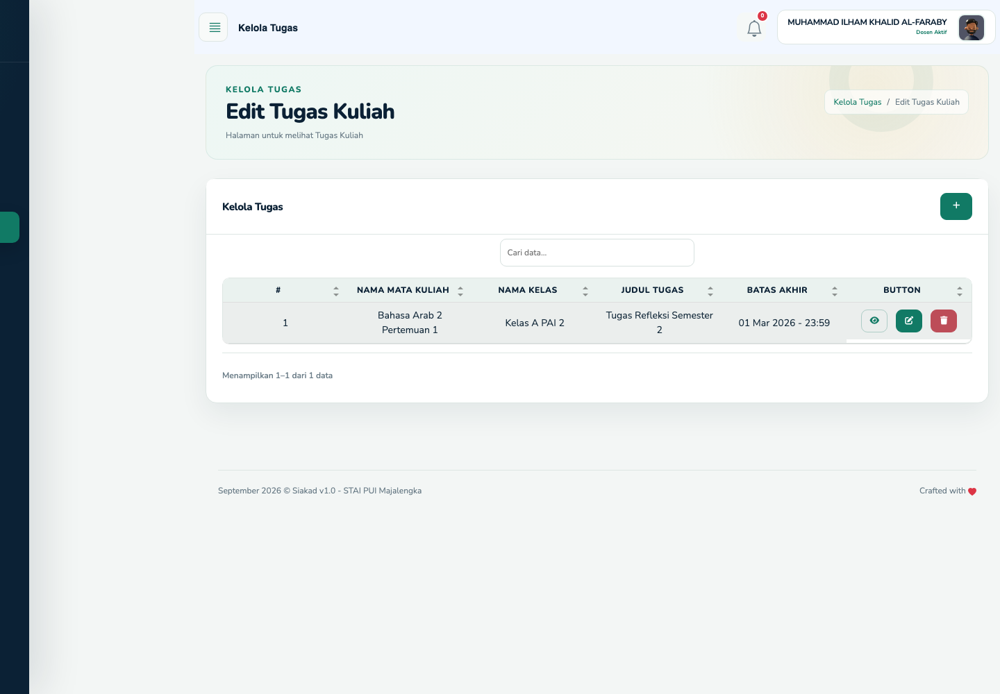

Ikon tindakan pada daftar digunakan untuk:

- membuka daftar pengumpulan mahasiswa;
- mengubah tugas; dan
- menghapus tugas.

Berhati-hatilah saat mengubah tenggat atau menghapus tugas. Beri tahu mahasiswa jika perubahan memengaruhi pekerjaan yang sedang dikerjakan atau sudah dikumpulkan.

### Memeriksa pengumpulan dan memberi skor

1. Klik ikon **Lihat** pada tugas.
2. Pilih pengumpulan mahasiswa yang akan diperiksa.
3. Baca jawaban/deskripsi dan buka lampiran yang tersedia.
4. Pastikan pengumpulan berasal dari mahasiswa dan tugas yang benar.
5. Isi skor bilangan bulat **0–10**.
6. Periksa skor sekali lagi, lalu simpan.

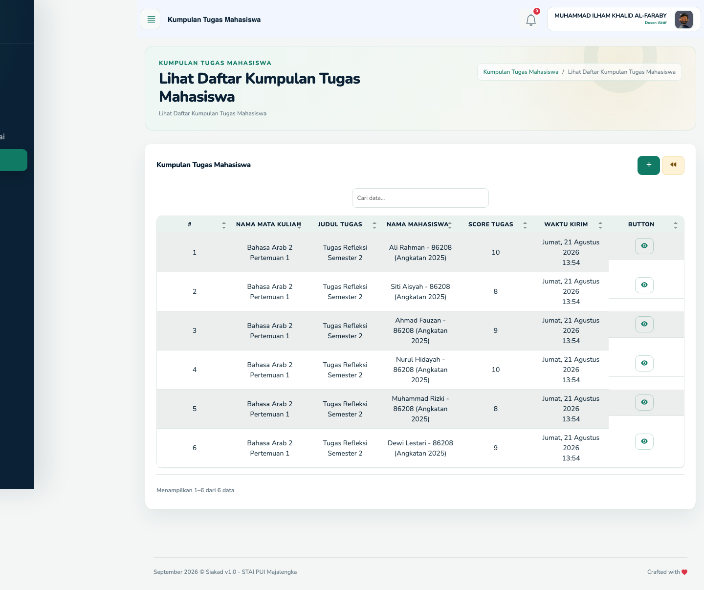

Skor tugas yang sudah disimpan tidak dapat diubah melalui alur biasa. Jika terjadi kesalahan, catat detailnya dan hubungi Academic atau Web Administrator untuk prosedur koreksi.

## 9. Menyetujui atau menolak KRS

1. Buka **Persetujuan KRS**.
2. Perhatikan ringkasan **Menunggu persetujuan**, **Telah disetujui**, dan **Perlu perbaikan**.
3. Cari pengajuan berstatus **Menunggu Persetujuan**, lalu klik **Lihat detail**.
4. Periksa:
   - identitas mahasiswa dan periode;
   - kelas mahasiswa;
   - mata kuliah dan dosen pengampu;
   - SKS setiap mata kuliah dan total beban studi;
   - catatan mahasiswa; serta
   - waktu pengajuan.
5. Isi **Catatan keputusan**. Catatan wajib diisi ketika meminta perbaikan dan akan terlihat oleh mahasiswa.
6. Klik **Setujui KRS** bila sudah sesuai, atau **Minta Perbaikan** bila mahasiswa harus memperbaikinya.
7. Periksa kembali pengajuan pada ringkasan status.

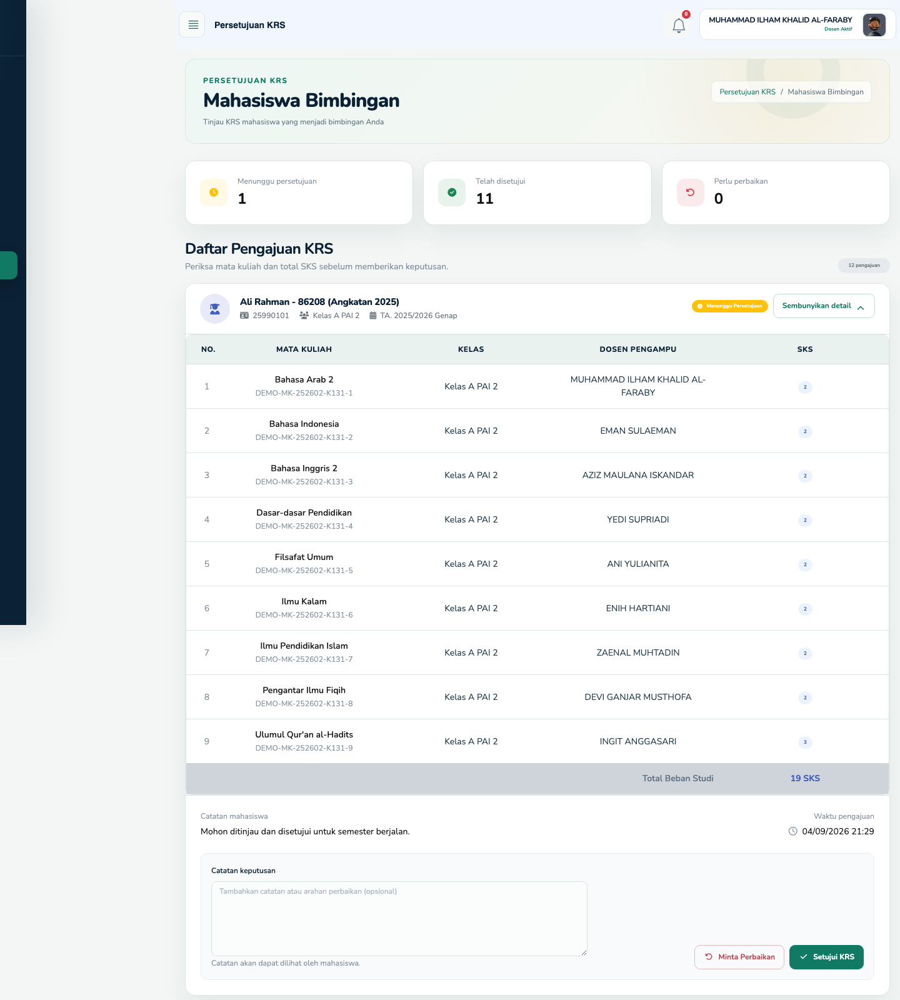

Hanya KRS berstatus diajukan yang dapat diputuskan. KRS yang disetujui tidak dapat diubah oleh mahasiswa melalui alur biasa. Jika keputusan perlu dikoreksi, hubungi Academic dan ikuti prosedur resmi.

## 10. Keluar dari akun

1. Klik nama atau foto akun di kanan atas.
2. Pilih **Logout/Keluar**.
3. Pastikan halaman kembali ke login, terutama setelah memakai perangkat bersama.

## 11. Kendala umum

| Kendala | Tindakan |
|---|---|
| Tidak dapat login | Periksa portal yang dipilih, NIDN/telepon/email, dan kata sandi. Pastikan akun berstatus aktif. |
| Periode belum tersedia | Tunggu periode dipublikasikan atau hubungi Web Administrator/Academic. |
| Jadwal atau mata kuliah tidak muncul | Minta Academic memeriksa penugasan dosen pada periode aktif. |
| Peserta kelas tidak lengkap | Pastikan KRS mahasiswa untuk mata kuliah tersebut sudah disetujui atau dikunci. |
| Presensi tidak dapat disimpan | Pastikan semua peserta diberi status dan periode masih dapat ditulis. |
| Impor nilai ditolak | Gunakan hasil ekspor sebagai template; periksa NIM, nilai A–E, format XLSX/CSV, dan batas 5 MB. |
| Pengajuan KRS tidak muncul | Pastikan mahasiswa terdaftar sebagai bimbingan dosen dan sudah mengajukan KRS. |
| Tidak dapat mengubah skor tugas | Skor yang sudah disimpan memerlukan prosedur koreksi khusus. |
| Halaman 403/404 | Data mungkin bukan milik jadwal, kelas, atau mahasiswa bimbingan akun yang sedang masuk. |

## Checklist rutin dosen

- [ ] Periode aktif pada dashboard sudah benar.
- [ ] Jadwal dan ruang diperiksa sebelum perkuliahan.
- [ ] Presensi diisi pada pertemuan yang tepat.
- [ ] Tugas memiliki instruksi dan tenggat yang jelas.
- [ ] Nilai akhir diperiksa sebelum periode ditutup.
- [ ] Pengajuan KRS ditinjau sebelum batas waktu.
- [ ] Akun sudah dikeluarkan setelah memakai perangkat bersama.

[Kembali ke daftar panduan](README.md)
